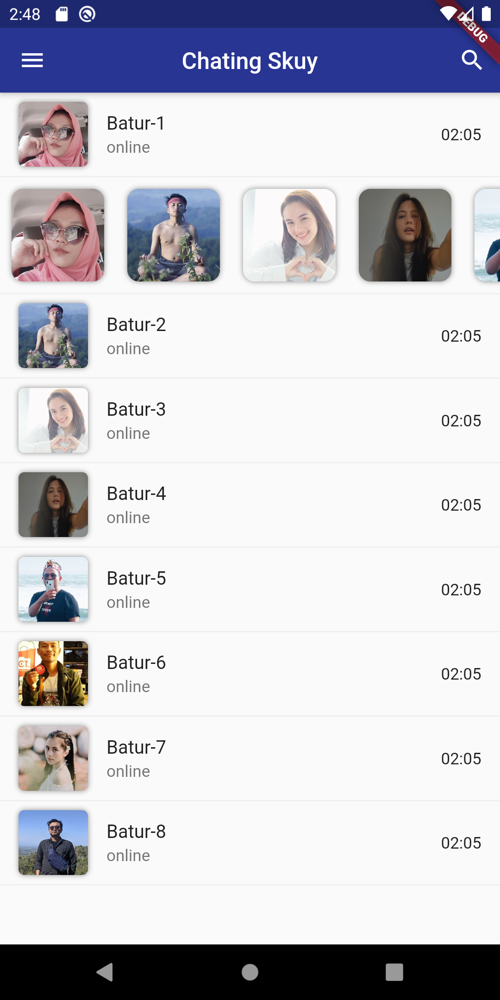
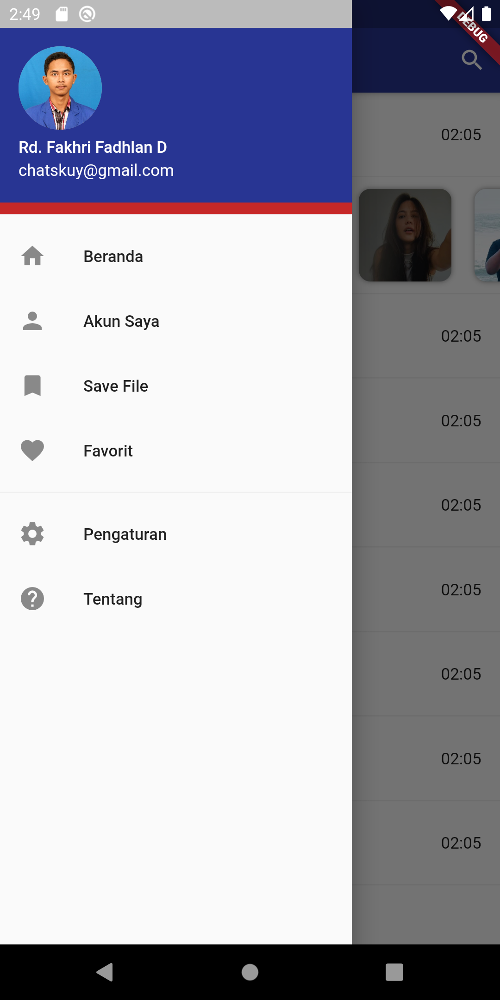
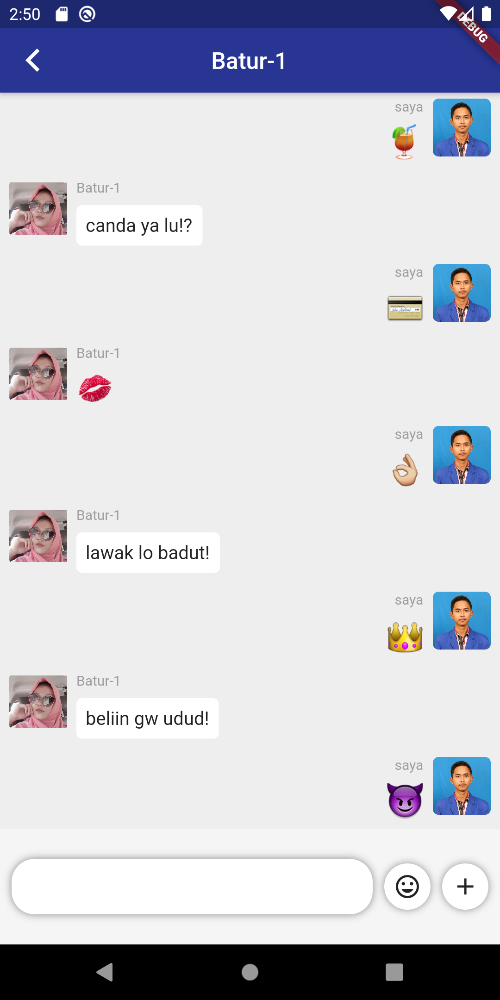

# Chat App

:: ENGLISH ::

- Build simple chatapp with listview
- Based Flutter IDE Android Studio.
- You guys can checkout in the demo section below this readme.md
- If something wrong with your IDE, try to update your flutter pluggin/SDK/IDE to latest version.
- Inspired by https://flutterawesome.com/a-flutter-customer-listview-that-displays-multiple-widget-types/
- thanks for appreciate my simple app, bella ciao!

:: INDONESIA ::

- Membangun aplikasi chat sederhana dengan listview serta avatar-nya
- Berbasis flutter dengan IDE Android Studio.
- Kalian bisa cek hasilnya di bagian demo bawah ini.
- Jika terjadi sesuatu, pastikan dan cobalah untuk mengperbarui flutter pluggin/SDK/IDE nya ke versi terbaru
- Terinspirasi dari https://flutterawesome.com/a-flutter-customer-listview-that-displays-multiple-widget-types/
- Terimakasih sudah mengapresiasi aplikasi simple ini, Dah!

## DEMO
 

## Getting Started

This project is a starting point for a Flutter application.

A few resources to get you started if this is your first Flutter project:

- [Lab: Write your first Flutter app](https://flutter.dev/docs/get-started/codelab)
- [Cookbook: Useful Flutter samples](https://flutter.dev/docs/cookbook)

For help getting started with Flutter, view our
[online documentation](https://flutter.dev/docs), which offers tutorials,
samples, guidance on mobile development, and a full API reference.
